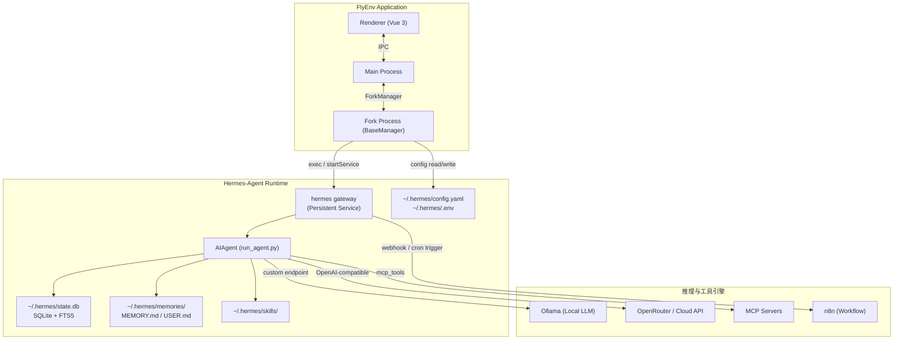
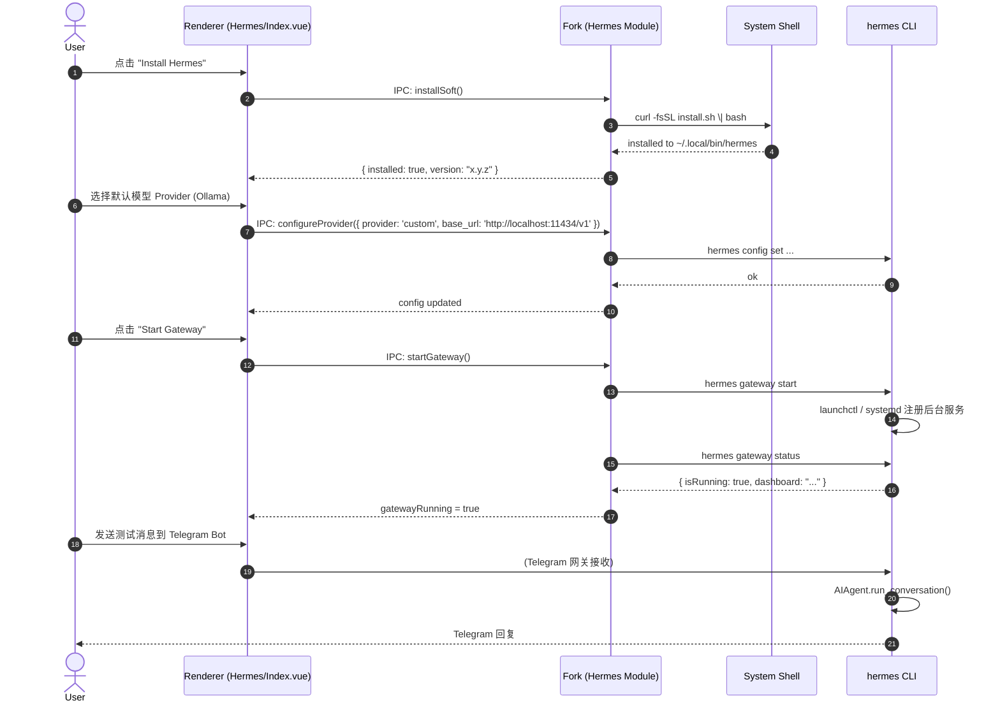
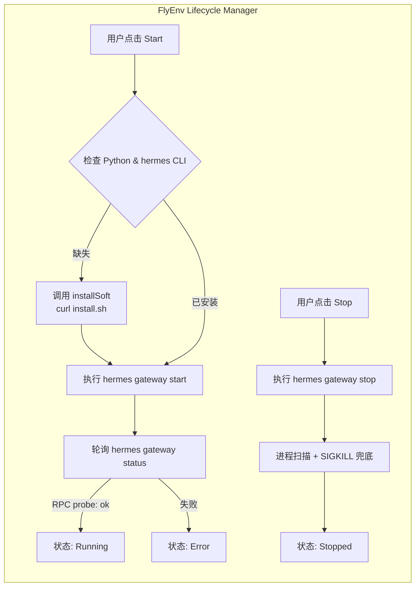
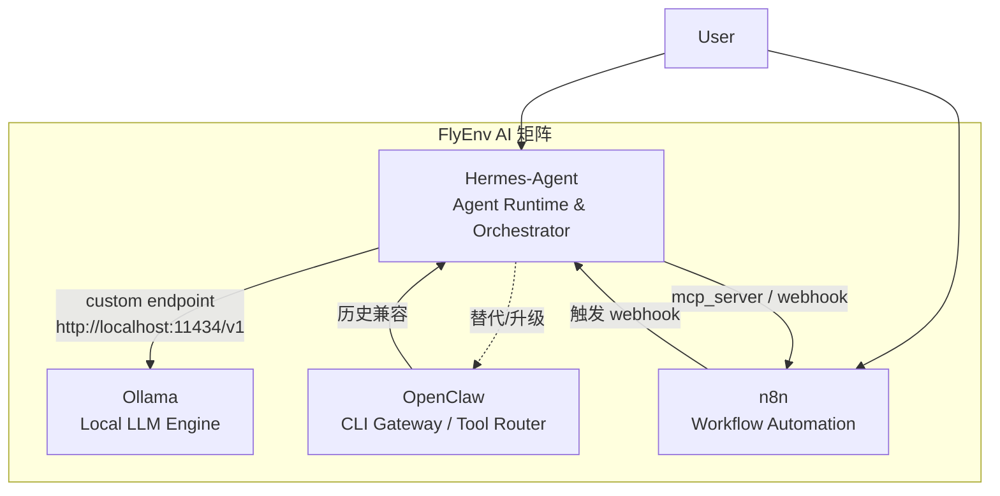

# Hermes-Agent 模块 FlyEnv 集成方案

> **文档版本**: v1.0  
> **编制日期**: 2026-04-14  
> **目标 FlyEnv 版本**: 4.13.2+  
> **依据文档**: Hermes-Agent Official Docs (hermes-agent.nousresearch.com) | FlyEnv DeepWiki (ollama / openclaw / n8n)

---

## 1. 模块定位 (Module Positioning)

**一句话定义**: Hermes-Agent 在 FlyEnv AI 矩阵中定位为**本地常驻 Agentic 编排中枢 (Local Agent Runtime & Orchestrator)** —— 它以 Ollama 作为可选的本地 LLM 推理引擎，以 n8n 作为结构化工作流执行器，以 OpenClaw 作为遗留 CLI 工具网关，自身则承担“具备持久记忆、技能进化与多平台网关能力的自主任务代理”角色。

**架构层级**: 
- **UI 层**: FlyEnv 渲染进程提供配置面板、技能商店、会话浏览与网关状态监控。
- **控制层**: FlyEnv Fork 进程通过 IPC 调用 `hermes` CLI，管理其生命周期与配置。
- **Agent 层**: `hermes gateway` 作为常驻后台进程，提供跨平台消息网关；`AIAgent` (Python) 处理推理循环、工具调用与记忆管理。
- **执行层**: 6 种 Terminal Backend (local / docker / ssh / modal / daytona / singularity) + MCP 工具生态 + 47 内置工具。



*来源: [FACT] `docs/developer-guide/architecture` 系统架构图；[FACT] `docs/user-guide/configuration` 目录结构说明。*

---

## 2. 核心价值 (User Value & Convenience)

| 场景 | 解决的痛点 | 关键支撑能力 |
|------|-----------|-------------|
| **S1: 本地智能秘书** | 开发者需要 7×24 可触达的 AI 助手，但不想把数据送往云端聊天产品。 | `hermes gateway` 常驻后台 + Telegram/Discord/Slack 多平台消息网关。[FACT] `docs/reference/cli-commands` 中列明 gateway 子命令；[FACT] `docs/integrations` 支持 15+ 平台。 |
| **S2: 自动化 cron 任务** | n8n 适合结构化工作流，但难以处理“需要 LLM 推理+工具调用”的开放式任务（如每日代码审查、竞品监控）。 | 内置 `hermes cron`，支持以自然语言 prompt 创建定时任务，并可将结果投递到任意消息平台。[FACT] `docs/reference/cli-commands` 中 `hermes cron create` 支持 `--skill` 与 `--deliver` 参数。 |
| **S3: 零代码扩展工具链** | 开发者想给 Agent 增加新能力（如操作 Jira、查询数据库），但不想写 FlyEnv 原生模块。 | MCP 集成：通过 `~/.hermes/config.yaml` 配置 stdio / HTTP MCP Server，自动发现工具。[FACT] `docs/user-guide/features/mcp` 支持动态 tool discovery 与 per-server 过滤。 |
| **S4: 跨会话持久记忆** | 传统 ChatGPT/Claude 网页版无法记住用户项目细节；本地 Ollama 聊天无记忆层。 | 内置 `MEMORY.md` / `USER.md` + FTS5 会话搜索 + 8 种外部 memory provider (Honcho/Mem0 等)。[FACT] `docs/user-guide/features/memory` 与 `docs/reference/cli-commands` 中 `hermes memory setup`。 |
| **S5: 可进化的技能系统** | 重复执行同类任务（如部署前后端服务）时，Agent 每次都要从零推理，耗时且费 token。 | Skills System：Agent 自主创建、改进并复用 procedural memory；兼容 agentskills.io 标准。[FACT] `docs/skills` 列出 644+ 技能；[FACT] `docs/developer-guide/architecture` 说明 skill_manage 工具。 |

---

## 3. 交互与用户界面逻辑 (UI/UX & Usage Logic)

### 3.1 模块 UI 结构

FlyEnv 遵循现有模块范式，在 `src/render/components/Hermes/` 下构建：

| 组件 | 职责 |
|------|------|
| `aside.vue` | 侧边栏开关、运行状态指示灯、快捷跳转 |
| `Index.vue` | Tab 容器，含 6 个标签页 |
| `Service.vue` | Gateway 启停控制、Dashboard 一键打开、XTerm 聊天入口 |
| `Config.vue` | `config.yaml` / `.env` 可视化编辑（继承 Conf 组件） |
| `Providers.vue` | 模型提供商配置（OpenRouter/Ollama/Anthropic 等快捷卡片） |
| `Skills.vue` | 技能搜索、安装、更新、平台启用配置 |
| `Sessions.vue` | 本地会话列表、FTS5 搜索、删除/重命名 |
| `Logs.vue` | 日志查看器（聚合 `agent.log` / `gateway.log` / `errors.log`） |

### 3.2 用户启用与配置流程



### 3.3 运行 Agent 任务的心智模型

| 操作路径 | 行为 |
|----------|------|
| **通过消息网关** | 用户直接在 Telegram/Discord 发送消息 → `hermes gateway` 路由到 `AIAgent` → 工具调用 → 返回结果。FlyEnv 仅监控网关状态与日志。 |
| **通过 FlyEnv 内嵌终端** | 用户在 `Service.vue` 点击 "Open Chat" → 渲染层新建 XTerm → 执行 `hermes chat` 或 `hermes chat -q "..."`，与本地 Shell 交互。 |
| **通过 Dashboard** | 用户在 `Service.vue` 点击 "Open Dashboard" → 调用 `hermes dashboard --no-open` 启动 FastAPI 服务 → FlyEnv 用 `shell.openExternal()` 打开浏览器。 |
| **通过 Cron 配置** | 用户在 `Skills.vue` 或独立 Cron 面板创建定时任务 → Fork 执行 `hermes cron create --prompt "..." --deliver telegram` → 任务持久化到 `~/.hermes/cron/`。 |

---

## 4. 技术实现与风险规避 (Technical Considerations & Mitigations)

### 4.1 部署模型

| 维度 | 结论 | 来源/说明 |
|------|------|-----------|
| **Runtime 依赖** | **Python 3.11+ 为强制依赖**。[FACT] FAQ 明确说明 "Hermes requires Python 3.11 or newer"；安装脚本使用 `uv` 创建虚拟环境。 | `docs/reference/faq/` |
| **部署形态** | **本地 Python 进程，非容器化**。核心入口为 `~/.local/bin/hermes` (shell wrapper)，实际代码在 `~/.hermes/hermes-agent/`。 | `docs/reference/faq/` |
| **可 Binary 化** | **不可直接二进制化**。[INFERRED] 项目为纯 Python 源码分发（git+pip），无 PyInstaller/nuitka 发布说明。FlyEnv 若追求“原生二进制优先”，需将 Hermes 视为受管理的 Python 包，而非单一可执行文件。 | 官方文档未提及 standalone binary。 |
| **Windows 支持** | **不支持原生 Windows**。[FACT] FAQ: "Not natively. Hermes Agent requires a Unix-like environment. On Windows, install WSL2"。 | `docs/reference/faq/` |
| **平台一致性** | macOS / Linux 为一等公民；Windows 仅通过 WSL2。FlyEnv Windows 版需标记为 "WSL2 Only" 或引导用户安装 WSL2。 | `docs/reference/faq/` |

### 4.2 生命周期管理设计

Hermes 的运行时包含两个独立概念：
1. **Gateway** (`hermes gateway start/run`) — 唯一适合 FlyEnv 接管的长生命周期服务。
2. **CLI Chat / Dashboard** — 用户按需启动的短生命周期进程。

因此，FlyEnv 模块应**仅将 Gateway 纳入标准服务生命周期管理**，其余功能作为“快捷动作”通过 XTerm 或子进程启动。



**健康检查**: 
- 调用 `hermes gateway status` 解析输出中的 `RPC probe: ok`。[FACT] OpenClaw 模块已采用相同模式解析 CLI 输出（`src/fork/module/OpenClaw/index.ts:47-90`）。
- 轮询策略：固定 3 秒等待 + 最多两次轮询，与 OpenClaw 模块保持一致。

**日志收集**:
- Hermes 日志固定位于 `~/.hermes/logs/agent.log`、`gateway.log`、`errors.log`。[FACT] `docs/reference/cli-commands` 中 `hermes logs` 说明。
- FlyEnv `Logs.vue` 可直接 `tail -n` 这些文件，或通过 IPC 调用 `hermes logs gateway -n 100`。

### 4.3 CLI / API 接口设计（FlyEnv ↔ Hermes）

由于 Hermes 核心**没有暴露稳定的 REST API**（除 Dashboard 与 MCP server mode 外），FlyEnv 与其交互应通过 **Fork 进程执行 CLI 命令** 完成，沿用 OpenClaw 的 `execPromiseWithEnv` 模式。

推荐的 IPC 命令映射：

| IPC 方法 | 底层 CLI | 返回值 | 用途 |
|---------|---------|--------|------|
| `checkInstalled` | `hermes --version` | `{ installed, version }` | 检测是否已安装 |
| `getGatewayStatus` | `hermes gateway status` | `{ isRunning, isInstalled, dashboard }` | 网关健康状态 |
| `startGateway` | `hermes gateway start` + 轮询 | `boolean` | 启动后台网关 |
| `stopGateway` | `hermes gateway stop` + `ProcessKill` | `boolean` | 停止后台网关 |
| `getConfigPath` | `hermes config path` / `env-path` | `{ config, env }` | 获取配置文件路径 |
| `listSessions` | `hermes sessions list` | `SessionItem[]` | 会话列表 |
| `listSkills` | `hermes skills list` | `string[]` | 已安装技能 |
| `installSkill` | `hermes skills install <name>` | `boolean` | 安装技能 |
| `openDashboard` | `hermes dashboard --port 9119 --no-open` | `boolean` | 启动 Dashboard 服务 |
| `runChat` | `hermes chat -q "..."` (XTerm) | stream | 内嵌终端聊天 |

### 4.4 与 Ollama / OpenClaw / n8n 的协同与边界



#### 协同分析

| 模块对 | 协同方式 | 潜在冲突 | 规避方案 |
|--------|---------|---------|---------|
| **Hermes ↔ Ollama** | Hermes 将 Ollama 作为 `provider: custom` 的本地推理端点，自动放宽 streaming timeout (1800s)。[FACT] `docs/integrations/providers/` 详细描述 Ollama 集成。 | 上下文长度配置不一致：Ollama 默认 `num_ctx` 可能只有 4K，而 Hermes 需要 ≥32K。 | FlyEnv 在同时启用两模块时，自动提示用户调整 `OLLAMA_CONTEXT_LENGTH` 环境变量，或在 Hermes config 中显式设置 `context_length`。 |
| **Hermes ↔ OpenClaw** | OpenClaw 是“CLI 工具链网关”，Hermes 是“具备工具调用能力的 Agent”。Hermes 提供 `hermes claw migrate` 帮助用户从 OpenClaw 迁移配置。[FACT] `docs/reference/cli-commands` 说明迁移命令。 | 两者都提供“gateway”概念，用户可能混淆。 | UI 层面明确标签：OpenClaw = "CLI Gateway"；Hermes = "AI Agent Gateway"。FlyEnv 可检测 OpenClaw 配置存在时，在 Hermes 安装向导中提供一键迁移入口。 |
| **Hermes ↔ n8n** | n8n 负责高可靠性、定时触发的结构化工作流；Hermes 负责需要 LLM 推理的开放式任务。Hermes 的 `hermes webhook subscribe` 可接收 n8n webhook；n8n 亦可调用 Hermes Dashboard/MCP 接口。 | 两者均有 cron 能力，可能出现重复调度。 | 产品层面建议：简单定时脚本用 n8n；需要 LLM 决策的定时任务用 Hermes cron。UI 中增加互跳链接。 |

### 4.5 风险矩阵

| 风险类别 | 具体风险 | 严重度 | 缓解措施 |
|---------|---------|--------|---------|
| **性能/资源** | Gateway 为 Python 进程， idle 时占用内存约 50–150 MB；Agent 推理时根据终端后端可能额外占用 Docker/本地资源。[ASSUMPTION] 官方文档未给出精确 idle 内存数据，基于 Python asyncio 长驻进程推断。 | 中 | 在 FlyEnv 配置页提供 `display.tool_progress: off` 与 `terminal.backend: local` 的默认低功耗模板。 |
| **模型依赖** | 本地模型工具调用支持参差不齐（如 llama.cpp 需 `--jinja`，vLLM 需 `--enable-auto-tool-choice`）。[FACT] `docs/integrations/providers/` 详细列出各 server 的 tool-calling flag。 | 中 | `Providers.vue` 根据用户选择的本地 server 类型，动态显示必需的启动参数检查清单。 |
| **平台差异** | Windows 不支持原生运行，与 FlyEnv 跨平台一致目标冲突。[FACT] FAQ 明确说明。 | 高 | Windows 版 FlyEnv 将该模块标记为 "WSL2 Required"；安装流程检测 WSL2 可用性，否则禁用启动按钮并弹出文档链接。 |
| **权限/安全** | Gateway 安装时使用 `sudo`（macOS LaunchAgent 写入）。[FACT] `docs/reference/faq/` 中 macOS gateway 安装章节提及权限问题。 | 低 | FlyEnv 在 macOS 上启动 Gateway 时，如遇权限失败，回退到 `hermes gateway run` foreground 模式，并在 UI 提示用户。 |
| **数据隔离** | Hermes 默认将配置、记忆、技能全部存放在 `~/.hermes/`，与 FlyEnv 的 `BaseDir` 隔离理念不完全一致。[FACT] `docs/user-guide/configuration` 说明目录结构。 | 低 | FlyEnv 可通过设置 `HERMES_HOME={BaseDir}/hermes` 环境变量（[ASSUMPTION] 基于标准 XDG 推断，需源码验证）将数据目录重定向到 FlyEnv 管理空间；若不支持，则提供符号链接或定期备份机制。 |

### 4.6 架构分层与数据流（总体设计）

```mermaid
flowchart TB
    subgraph UI["UI Layer (Renderer)"]
        A[aside.vue 状态开关]
        B[Index.vue Tab 容器]
        C[Service.vue 网关控制 + Dashboard/Chat 入口]
        D[Config.vue YAML/ENV 编辑]
        E[Providers.vue 模型配置]
        F[Skills.vue 技能管理]
        G[Sessions.vue 会话浏览]
        H[Logs.vue 日志聚合]
    end

    subgraph Control["Control Layer (Fork)"]
        I[Hermes Module<br/>src/fork/module/Hermes/index.ts]
        J[execPromiseWithEnv<br/>调用 hermes CLI]
        K[ProcessKill / status 轮询]
    end

    subgraph Agent["Agent Layer"]
        L[hermes gateway<br/>(Persistent Process)]
        M[AIAgent<br/>run_agent.py]
        N[MCP Client<br/>tools/mcp_tool.py]
    end

    subgraph Exec["Execution Layer"]
        O[Terminal Backend<br/>local/docker/ssh/modal/daytona/singularity]
        P[Ollama / vLLM / Cloud API]
        Q[MCP Servers]
    end

    A --> B
    B --> C & D & E & F & G & H
    C -->|IPC: startGateway/stopGateway| I
    D -->|IPC: getConfigPath / 写文件| I
    F -->|IPC: installSkill/listSkills| I
    G -->|IPC: listSessions| I
    H -->|readFile / hermes logs| I
    I --> J
    J -->|hermes gateway start| L
    J -->|hermes skills install ...| M
    L --> M
    M -->|chat/completions| P
    M --> N --> Q
    M -->|terminal / execute_code| O
```

---

## 5. 引用来源索引

| 章节 | 引用内容 | 来源文档路径 |
|------|---------|-------------|
| 架构与目录结构 | `~/.hermes/` 目录结构、`run_agent.py`、GatewayRunner | `docs/developer-guide/architecture` [FACT] |
| 配置系统 | `config.yaml`、`.env`、终端后端配置、辅助模型 | `docs/user-guide/configuration` [FACT] |
| CLI 命令 | `hermes gateway`、`hermes skills`、`hermes cron`、`hermes claw migrate` | `docs/reference/cli-commands` [FACT] |
| FAQ / 平台支持 | Python 3.11+ 要求、Windows 不支持原生、WSL2 要求、Ollama 集成 | `docs/reference/faq/` [FACT] |
| 工具与 MCP | 47 工具、19 toolsets、MCP stdio/HTTP 配置、工具过滤 | `docs/user-guide/features/tools` / `docs/user-guide/features/mcp` [FACT] |
| 记忆系统 | `MEMORY.md` / `USER.md`、FTS5、外部 memory provider | `docs/user-guide/features/memory` [FACT] |
| 技能系统 | 644 技能、agentskills.io 兼容、`hermes skills` CLI | `docs/skills` [FACT] |
| AI 提供商 | Ollama / vLLM / SGLang / llama.cpp 的 tool-calling flag 与上下文配置 | `docs/integrations/providers/` [FACT] |
| 安全模型 | Gateway 授权、dangerous command approval、Docker 安全加固 | `docs/user-guide/security` [FACT] |
| FlyEnv 本地上下文 | Ollama 模块生命周期、OpenClaw gateway 状态解析模式、n8n 用户管理 | `@docs/deepwiki/ollama.md` / `@docs/deepwiki/openclaw.md` / `@docs/deepwiki/n8n.md` [FACT] |

---

*本文档所有关键结论均标注了可信度标签：`[FACT]` 为官方文档直接确认信息，`[INFERRED]` 为基于文档的合理推断，`[ASSUMPTION]` 为信息缺失时的必要假设。*
